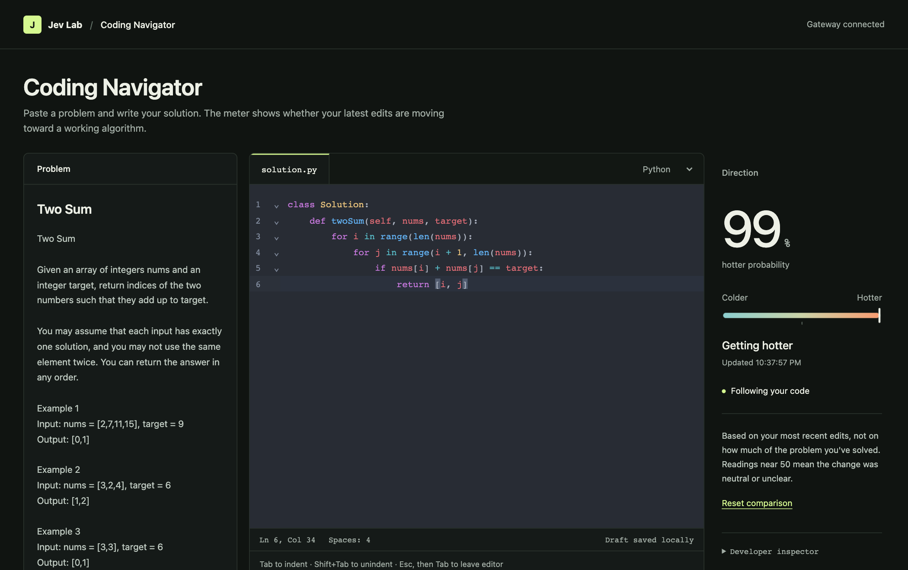
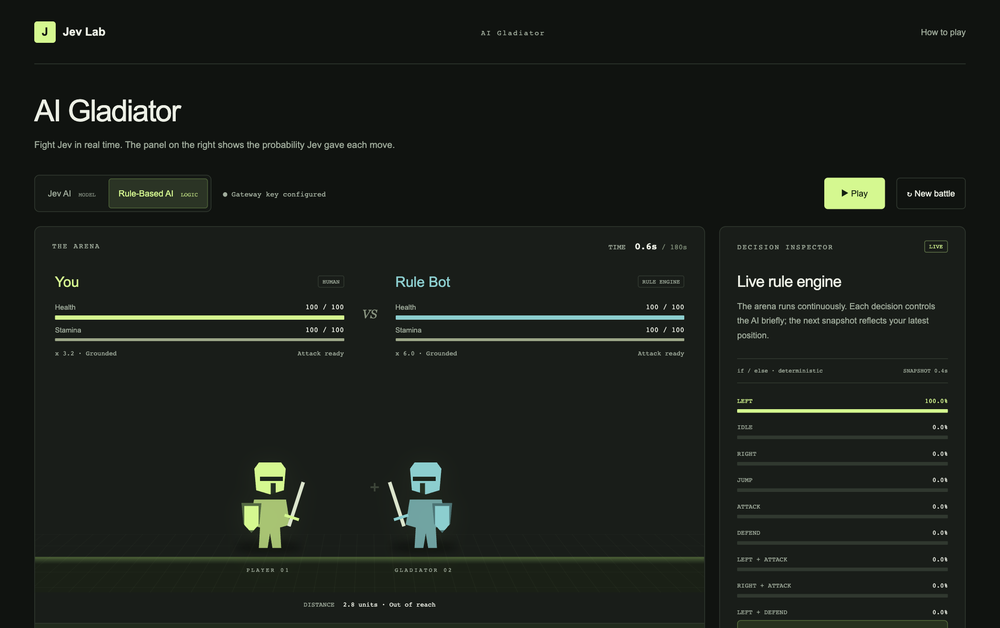

# Jev Lab

**Two small browser projects that show how an AI model makes decisions: a real-time fighting game and a coding tutor that tells you whether you're getting "hotter" or "colder."**

Both run on [`typesafe-ai/jev`](https://vercel.com/kb/guide/typesafe-jev-and-ai-sdk), a model on the [Vercel AI Gateway](https://vercel.com/docs/ai-gateway) that answers multiple-choice questions with a probability for each option. Jev Lab puts those probabilities on screen so you can see what the model chose and how confident it was. Everything runs on your machine through one small Node server, and your API key never reaches the browser.



## Projects

### Coding Navigator (`/tutor`)

Paste a LeetCode-style problem and write a solution in Python or JavaScript. As you type, a meter moves toward **hotter** when your edits bring you closer to a working algorithm and toward **colder** when they lead you away. It never shows you the answer, and your code is never run.

Behind the scenes, a larger model first maps the problem's solution space: brute-force, acceptable and optimal approaches, the partial steps between them, and common dead ends. Jev then compares each batch of your edits against that map. See [How the Navigator works](#how-the-navigator-works).

### AI Gladiator (`/arena`)

A real-time 2D fight. About twice a second Jev reads both fighters' position, speed, stamina and cooldowns, then picks one of 12 moves. A side panel shows the probability it gave each one. A built-in rule-based opponent works without an API key.



*Screenshot shows the offline rule-based opponent. In Jev mode the panel shows the model's probabilities.*

## Requirements

- **Node.js 22.18 or newer** (`node --version` to check)
- **A Vercel AI Gateway API key** with available credits. Create one in the AI Gateway section of your Vercel dashboard. The Arena's rule-based mode works without one.
- A current desktop browser. Tested on macOS with Chrome.

## Quick start

```sh
git clone https://github.com/kairugakuo2/jev-arena.git
cd jev-arena
npm install
cp .env.example .env
```

Open `.env` and paste your key after `AI_GATEWAY_API_KEY=`. Then start the server:

```sh
npm start
```

`npm start` bundles the Navigator's editor, then starts the server. You should see:

```text
Jev Lab → http://localhost:3000
```

Open http://localhost:3000. The top-right corner should say **Gateway key configured**.

If `npm start` fails with `node: bad option: --env-file-if-exists`, your Node.js is older than 22.18. Upgrade it, or with nvm run `nvm use 22`.

### Try the Navigator

1. Open **Coding Navigator**. Two Sum is filled in as an example problem.
2. Click **Prepare problem**. The first run for a new problem builds its solution map, which takes about 90 seconds. After that it's cached in `.cache/tutor/` and loads instantly.
3. Start typing a solution. The meter updates a moment after each pause. A nested-loop brute force should read strongly hotter. Swapping in a hash map should read hotter again.

## Configuration

All settings live in `.env`. The server reads it at startup, so restart after changing it.

| Variable | Required | Default | Purpose |
|---|---|---|---|
| `AI_GATEWAY_API_KEY` | For AI features | none | Your Vercel AI Gateway key |
| `PORT` | No | `3000` | Local port |
| `TUTOR_MAP_MODEL` | No | `openai/gpt-5-mini` | Model that builds solution maps. It must support schema-enforced structured output through the Gateway. |

## How the Navigator works

1. **Map the problem (once).** The mapmaker model writes a structured description of the solution space. A second pass reviews it for real errors, such as a wrong expected output. Wording nitpicks don't block approval. If it finds a blocking error, the map is repaired once. Approved maps are cached on disk.
2. **Sample your code.** The browser sends a snapshot about 300 ms after you stop typing, or at most every second while you keep typing. Only one request is in flight at a time, and results that arrive after newer edits are dropped.
3. **Judge the direction.** Jev gets the map, your code before and after your latest edits, and a short edit history. It returns `{ hotter, colder }` probabilities, usually within 300–800 ms.
4. **Move the meter.** The needle eases toward each new reading instead of jumping.

The reading describes the direction of your recent edits. It isn't a grade, and it doesn't measure how close you are to finishing.

## AI Gladiator controls

| Action | Keys |
|---|---|
| Run | **A / D** or **← / →** |
| Jump | **Space**, **W** or **↑** |
| Attack | **J** (0.65 s cooldown) |
| Guard | **K** or **Shift** |
| Pause | **P** or **Esc** |

Touch devices get on-screen buttons. Full combat rules are under **How to play** on the Arena page.

## Development

```sh
npm test         # 31 tests: game physics, scheduler timing, schema and API routes
npm run build    # rebuild public/tutor/bundle.js after editing public/tutor/*.js
```

```text
server.js              Local server: file allowlist, security headers, API routes
jev-ai.js              Builds the Arena's Jev request
public/index.html      Project dashboard
public/arena.html      AI Gladiator page; game logic in public/arena/
public/tutor.html      Coding Navigator page; browser code in public/tutor/
tutor/                 Navigator server code: prompts, schema, map cache, routes
test/                  node:test suites
```

[CHANGELOG.md](CHANGELOG.md) lists what changed in each version.

## Limitations

- **Local only.** The server binds to `127.0.0.1` and rejects requests from other origins. It isn't built to be hosted publicly.
- **Costs money to use.** Every Navigator reading and every Jev move in the Arena is a paid Gateway call. Preparing a new problem makes several larger model calls.
- **Occasional dropped readings.** The Gateway sometimes returns "high demand" errors for Jev. The app retries with backoff, and the meter holds its last reading in the meantime.
- **The map isn't exhaustive.** A valid approach the mapmaker didn't anticipate may read as neutral rather than hotter.
- **Python and JavaScript only** in the Navigator.
- **Experimental API.** Jev is called through the AI SDK's `experimental_evaluate`, which may change.

## Feedback

Found a bug or have an idea? [Open an issue](https://github.com/kairugakuo2/jev-arena/issues).
