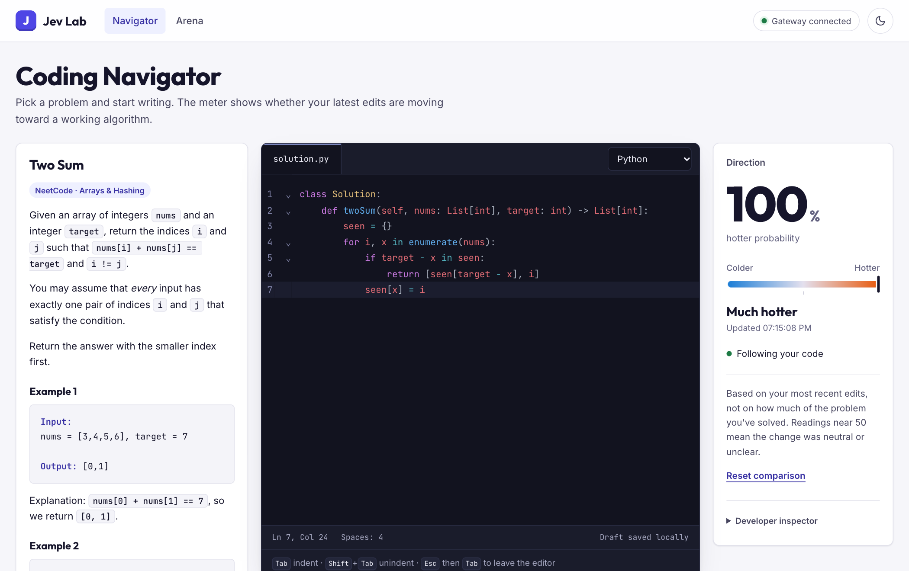
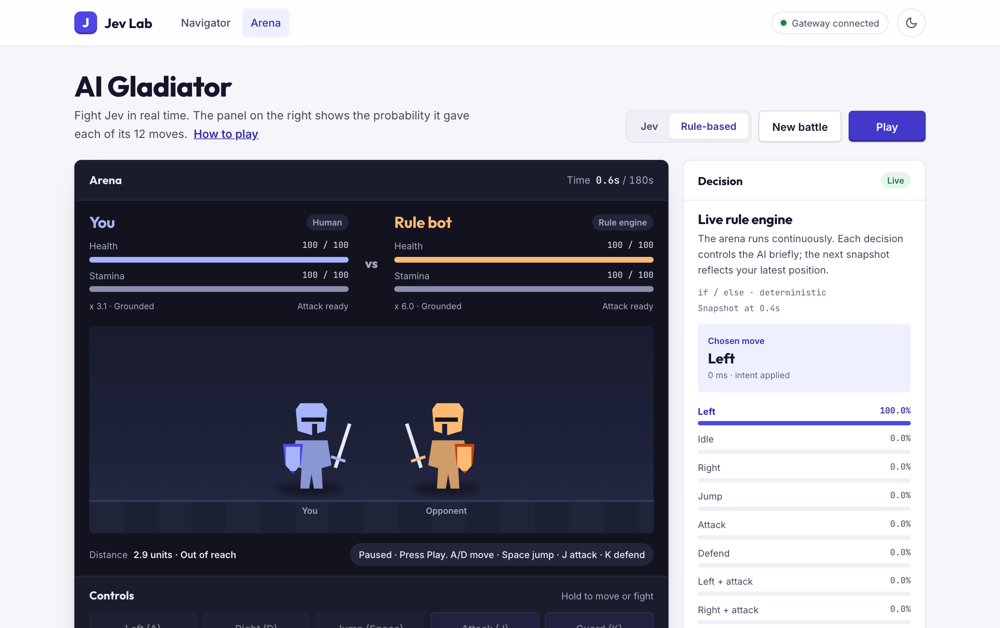

# Jev Lab

**Two small browser projects that show how an AI model makes decisions: a real-time fighting game and a coding tutor that tells you whether you're getting "hotter" or "colder."**

Both run on [`typesafe-ai/jev`](https://vercel.com/kb/guide/typesafe-jev-and-ai-sdk), a model on the [Vercel AI Gateway](https://vercel.com/docs/ai-gateway) that answers multiple-choice questions with a probability for each option. Jev Lab puts those probabilities on screen so you can see what the model chose and how confident it was. Everything runs on your machine through one small Node server, and your API key never reaches the browser.

<picture>
  <source media="(prefers-color-scheme: dark)" srcset="public/images/navigator-dark.png">
  
</picture>

## Projects

### Coding Navigator (`/tutor`)

Choose from the built-in NeetCode 150 library or paste a custom problem, then write a solution in Python or JavaScript. Search and filter the library by pattern and difficulty; **Surprise me** picks a problem inside your active filters. Imported problems open with NeetCode's starter class, method signature and parameters already in the editor. As you type, Jev rates the direction of recent edits from **much colder** through **much hotter**. It never shows you the answer, and your code is never run.

Problems read like they do on LeetCode: inline code, bold and italic text, example blocks with highlighted **Input** and **Output** labels, and a constraints list. You can start typing as soon as the question appears, while Jev prepares its feedback in the background.

Behind the scenes, a larger model first maps the problem's solution space: brute-force, acceptable and optimal approaches, the partial steps between them, and common dead ends. Jev then compares each batch of your edits against that map. See [How the Navigator works](#how-the-navigator-works).

### AI Gladiator (`/arena`)

A real-time 2D fight. About twice a second Jev reads both fighters' position, speed, stamina and cooldowns, then picks one of 12 moves. A side panel shows the probability it gave each one. A built-in rule-based opponent works without an API key.

<picture>
  <source media="(prefers-color-scheme: dark)" srcset="public/images/arena-dark.png">
  
</picture>

*Screenshot shows the offline rule-based opponent. In Jev mode the panel shows the model's probabilities.*

### Light and dark mode

Every page has a light and a dark theme. Jev Lab follows your system setting until you use the moon/sun button in the top bar, then remembers your choice in the browser. The code editor and arena stage stay dark in both themes. Screenshots above switch to match GitHub's theme.

## Requirements

- **Node.js 22.18 or newer** (`node --version` to check)
- **A Vercel AI Gateway API key** with available credits. Create one in the AI Gateway section of your Vercel dashboard. The Arena's rule-based mode works without one.
- A current desktop browser. Tested on macOS with Chrome.

## Quick start

```sh
git clone https://github.com/kairugakuo2/jev-arena.git
cd jev-arena
npm install
cp .env.example .env
```

Open `.env` and paste your key after `AI_GATEWAY_API_KEY=`. Then start the server:

```sh
npm start
```

`npm start` bundles the Navigator's editor, then starts the server. You should see:

```text
Jev Lab → http://localhost:3000
```

Open http://localhost:3000. The top-right corner should say **Gateway key configured**.

If `npm start` fails with `node: bad option: --env-file-if-exists`, your Node.js is older than 22.18. Upgrade it, or with nvm run `nvm use 22`.

### Try the Navigator

1. Open **Coding Navigator** and choose a problem from the NeetCode 150 library. The **Custom** tab still accepts a full problem statement you paste yourself.
2. The question and starter code appear in under a second, and you can start typing right away. Jev builds its solution map in the background, which takes about 20 seconds the first time a problem is opened. Later opens use the cache and are instant.
3. Once the map is ready, the meter starts following your edits, including anything you typed while it was preparing. It updates a moment after each pause. A nested-loop brute force should read strongly hotter. Swapping in a hash map should read hotter again.

Python and JavaScript drafts are stored separately for each library problem. The 20 most recently used problem drafts share a 2 MiB local browser budget. This early version does not track attempts or completion. Older local progress is discarded; drafts remain available.

## Configuration

All settings live in `.env`. The server reads it at startup, so restart after changing it.

| Variable | Required | Default | Purpose |
|---|---|---|---|
| `AI_GATEWAY_API_KEY` | For AI features | none | Your Vercel AI Gateway key |
| `PORT` | No | `3000` | Local port |
| `HOST` | No | `127.0.0.1` | Address to listen on. Use `0.0.0.0` when hosting. |
| `PUBLIC_URL` | When hosting | none | The site's public address, e.g. `https://jev-lab.onrender.com`. Allows that host and origin, and turns on the demo limits. On Render this comes from `RENDER_EXTERNAL_URL` automatically. |
| `TRUST_PROXY` | When hosting | off | Set to `1` behind a proxy (like Render) so visitors are told apart by their real address. |
| `TUTOR_MAP_MODEL` | No | `google/gemini-2.5-flash-lite` | Model that builds and reviews solution maps. It must support JSON-schema output through the Gateway. `openai/gpt-5-mini` produces more detailed maps but is slower and costs more. |

## How the Navigator works

1. **Import and map the problem (once).** For a library problem, the server imports the visible statement and starter code plus hidden NeetCode article prose and complete Python/JavaScript references. The browser receives the statement, starter code and attribution, never the hidden solutions. The mapmaker writes a structured description of the solution space, and a second pass reviews it for real errors. Custom problems use only the pasted statement. Approved maps are cached on disk.
2. **Sample your code.** The browser sends a snapshot about 300 ms after you stop typing, or at most every second while you keep typing. Only one request is in flight at a time, and results that arrive after newer edits are dropped.
3. **Judge the direction.** Jev gets the map, your code before and after your latest edits, and a short edit history. It returns `{ hotter, colder }` probabilities, usually within 300–800 ms.
4. **Move the meter.** The needle eases toward each new reading instead of jumping.

The reading describes the direction of your recent edits. It isn't a grade, and it doesn't measure how close you are to finishing.

### NeetCode source and cache behavior

- The bundled catalog contains metadata only. Selecting a problem makes the first network request to NeetCode; source content is never committed to this repository.
- Imported sources are validated, hashed and atomically cached under `.cache/tutor/sources/` with private file permissions. Entries older than seven days are revalidated. If that refresh fails, a validated stale entry remains usable.
- Requests are restricted to HTTPS on `neetcode.io` and the official `raw.githubusercontent.com/neetcode-gh/leetcode` repository, with short timeouts, redirect limits, content-type checks and bounded streaming reads.
- The current NeetCode site renders problem pages in the browser, so the importer uses the same public problem-metadata endpoint as NeetCode's frontend for the visible description. It reads article prose and reference files from the official repository. Upstream HTML, API or repository layout changes may require a parser update.
- The visible description is converted on the server into a small list of blocks (paragraphs, headings, code, lists) and rendered in the browser with `textContent` only, so NeetCode markup is never parsed as HTML. Hint sections are dropped.
- Imported text is treated as untrusted model input. Visible starter code is returned as text for the editor; hidden references, raw source records and solution graphs are never returned by browser APIs.

The official [NeetCode solution repository](https://github.com/neetcode-gh/leetcode) is [MIT-licensed](https://github.com/neetcode-gh/leetcode/blob/main/LICENSE). Jev Lab attributes imported problems to NeetCode and keeps the fetched text local. It does not use LeetCode's undocumented GraphQL endpoint or scrape LeetCode pages; [LeetCode's terms prohibit crawling and scraping](https://leetcode.com/terms/).

## AI Gladiator controls

| Action | Keys |
|---|---|
| Run | **A / D** or **← / →** |
| Jump | **Space**, **W** or **↑** |
| Attack | **J** (0.65 s cooldown) |
| Guard | **K** or **Shift** |
| Pause | **P** or **Esc** |

Touch devices get on-screen buttons. Full combat rules are under **How to play** on the Arena page.

## Deploy your own

The repo includes a [Render](https://render.com) Blueprint (`render.yaml`), so hosting a public copy takes a few clicks:

1. **Protect your key first.** In the Vercel dashboard, give your AI Gateway key a spending limit, or create a separate key just for the demo so you can revoke it on its own.
2. Sign in to Render with GitHub, then choose **New → Blueprint** and pick this repository.
3. Paste your `AI_GATEWAY_API_KEY` when Render asks for it, and deploy.

Render builds the editor bundle, starts the server and gives you an `https://….onrender.com` link. Every push to `main` redeploys.

**Free plan notes:** the service sleeps after 15 minutes without visitors, and the next visit takes about a minute to wake it, so open the link shortly before you present. Render's disk resets on each restart, so the first time someone opens a problem after that, its map is rebuilt (about 20 seconds). The $7/month Starter plan stays awake.

### Demo limits

When the site is public, paid AI calls are rate limited. Browsing and the Arena's rule-based mode are never limited.

| What | Per visitor, per hour | Per network, per hour | Whole site, per day |
|---|---|---|---|
| Jev moves in the Arena | 600 (about 3 battles) | 3,000 | 8,000 |
| Navigator readings | 600 | 3,000 | 8,000 |
| New problem setups | 15 | 60 | 150 |

A visitor is a random ID each browser keeps. The per-network limit is looser, so a room full of people on one Wi-Fi can all use the demo. Opening a problem whose map is already cached doesn't count. Past a limit, visitors see a short message saying when to try again. Change any number with an environment variable named `RATE_<WHAT>_<SCOPE>`, for example `RATE_ARENA_VISITOR=300` or `RATE_PREPARE_DAILY=50` (`WHAT` is `ARENA`, `EVALUATE` or `PREPARE`; `SCOPE` is `VISITOR`, `IP` or `DAILY`). Limits reset when the server restarts, so the spending limit on your key is the real backstop.

## Development

```sh
npm test         # game, scheduler, importer, statement formatting, storage, schema and API tests
npm run build    # rebuild public/tutor/bundle.js after editing public/tutor/*.js
```

```text
server.js              Server: file allowlist, security headers, host/origin checks, API routes
rate-limit.js          Demo rate limits for paid AI calls when the site is public
render.yaml            Render Blueprint for hosting
jev-ai.js              Builds the Arena's Jev request
public/site.css        Shared design system: colors (light and dark), type, nav, buttons
public/theme.js        Light/dark theme switch, set before first paint
public/fonts/          Self-hosted Outfit, Inter and JetBrains Mono (SIL OFL)
public/index.html      Home page
public/arena.html      AI Gladiator page; game logic in public/arena/
public/tutor.html      Coding Navigator page; browser code in public/tutor/
tutor/                 Navigator server code: prompts, schema, map cache, routes,
                       and statement-format.js (NeetCode Markdown to safe display blocks)
test/                  node:test suites
```

[CHANGELOG.md](CHANGELOG.md) lists what changed in each version.

## Limitations

- **Small-scale hosting only.** Locally the server listens on `127.0.0.1` only. When hosted, it accepts only its configured public address and applies the demo limits above. Everything (jobs, caches, limits) lives in one process, so it's meant for a single small instance, not a fleet.
- **Costs money to use.** Every Navigator reading and every Jev move in the Arena is a paid Gateway call. Preparing a new problem makes several larger model calls.
- **Occasional dropped readings.** The Gateway sometimes returns "high demand" errors for Jev. The app retries with backoff, and the meter holds its last reading in the meantime.
- **The map isn't exhaustive.** A valid approach the mapmaker didn't anticipate may read as neutral rather than hotter.
- **Python and JavaScript only** in the Navigator.
- **Source formats can change.** The importer is intentionally narrow and fails closed if NeetCode's public metadata or repository layout no longer matches its validated format. You can still use the Custom tab.
- **Experimental API.** Jev is called through the AI SDK's `experimental_evaluate`, which may change.

## Feedback

Found a bug or have an idea? [Open an issue](https://github.com/kairugakuo2/jev-arena/issues).
